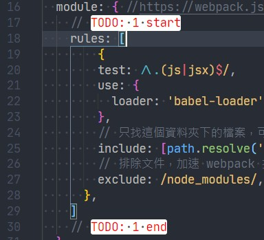

# Get Started

## 1 install nodejs

- 選擇左邊的 stable 版 (14.x.x)
- 安裝完成後，可以開啟終端機，輸入
    ```
  node -v
  ```
  如果有出現版本號，表示正確安裝
  
- - - 


## 2 install vscode


- - - 
## 3 install vscdoe extensions - Todo Tree

- 這個套件可以讓 vscode 遇到 TODO 這個文字時能夠 highlight
- 在這一系列的教學裡，奶綠我都會用這個方便標記重要的程式碼，方便大家學習
- 